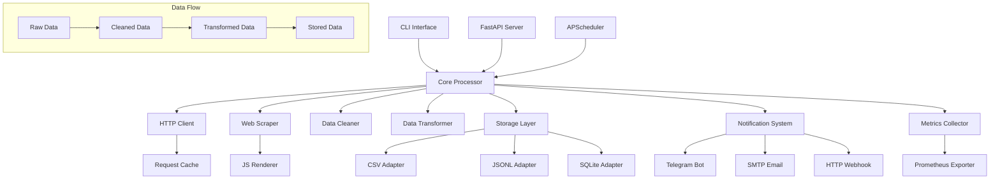

# HEX Data Processor Architecture

## Overview

HEX Data Processor is built with a modular, async-first architecture designed for scalability, maintainability, and extensibility. The system follows a pipeline pattern for data processing with pluggable components.

## System Architecture



## Core Components

### 1. Configuration System (`config.py`)

**Purpose**: Centralized configuration management with validation

**Key Features**:
- Pydantic-based validation
- Environment variable substitution
- JSON schema validation
- Type-safe configuration access

**Architecture**:
```
Config (Root)
├── ProjectConfig
├── ScraperConfig
├── TargetConfig[]
├── CleanerConfig
├── TransformerConfig
├── StorageConfig
├── NotificationsConfig
├── SchedulerConfig
├── MetricsConfig
└── LoggingConfig
```

### 2. HTTP Client (`http_client.py`)

**Purpose**: Async HTTP requests with retry logic and rate limiting

**Key Features**:
- Async/await support with httpx
- Exponential backoff retry
- Rate limiting with jitter
- Request/response logging
- Proxy support

**Design Patterns**:
- Context manager for resource cleanup
- Tenacity for retry logic
- Async semaphore for concurrency control

### 3. Web Scraper (`scraper.py`)

**Purpose**: Extract data from websites using CSS selectors

**Key Features**:
- BeautifulSoup for static parsing
- Optional Playwright/Selenium for JS rendering
- Pagination support
- robots.txt checking
- Metadata injection

**Data Flow**:
```
URLs → HTTP Requests → HTML Parsing → CSS Selector → Data Items
```

### 4. Data Cleaner (`cleaner.py`)

**Purpose**: Clean and validate extracted data

**Key Features**:
- Duplicate detection and removal
- Missing value handling
- Field validation with Pydantic
- Text normalization
- Type checking

**Processing Pipeline**:
```
Raw Items → Text Cleaning → Duplicate Removal → Field Validation → Clean Items
```

### 5. Data Transformer (`transformer.py`)

**Purpose**: Transform cleaned data into desired format

**Key Features**:
- Field mapping/renaming
- Type conversion
- Custom Python functions
- Safe lambda evaluation
- Expression parsing

**Transformation Pipeline**:
```
Clean Items → Field Mapping → Type Conversion → Custom Functions → Final Items
```

### 6. Storage Layer (`storage/`)

**Purpose**: Persist processed data to various storage backends

**Architecture**:
```
StorageAdapter (Abstract Base)
├── CSVStorageAdapter
├── JSONLStorageAdapter
└── SQLiteStorageAdapter
```

**Key Features**:
- Async I/O operations
- Transaction support
- Backup functionality
- Health checks
- Schema management

### 7. Notification System (`notifier.py`)

**Purpose**: Send notifications about processing status

**Architecture**:
```
NotificationManager
├── TelegramNotifier
├── EmailNotifier
└── WebhookNotifier
```

**Key Features**:
- Template-based messages
- Async sending
- Error handling
- Configurable triggers

### 8. Scheduler (`scheduler.py`)

**Purpose**: Execute scheduled data processing jobs

**Key Features**:
- APScheduler integration
- Cron and interval triggers
- Job lifecycle management
- Async job execution
- Health monitoring

### 9. Metrics System (`metrics.py`)

**Purpose**: Collect and expose metrics for monitoring

**Key Features**:
- Prometheus integration
- Custom metrics collection
- HTTP middleware
- Health checks
- Performance tracking

### 10. API Layer (`api/`)

**Purpose**: HTTP API for monitoring and control

**Endpoints**:
- `/health` - Health status
- `/metrics` - Prometheus metrics
- `/stats` - Processing statistics
- `/config` - Configuration (sanitized)

## Data Processing Pipeline

### 1. Initiation

```
CLI/API → Configuration Loading → Component Initialization
```

### 2. Scraping Phase

```
Target Config → URL Generation → HTTP Requests → HTML Parsing → Data Extraction
```

### 3. Cleaning Phase

```
Raw Data → Text Normalization → Duplicate Detection → Validation → Clean Data
```

### 4. Transformation Phase

```
Clean Data → Field Mapping → Type Conversion → Custom Functions → Final Data
```

### 5. Storage Phase

```
Final Data → Storage Adapter → File/Database → Confirmation
```

### 6. Notification Phase

```
Processing Result → Notification Manager → Channels (Telegram/Email/Webhook)
```

## Configuration Architecture

### Hierarchical Configuration

```json
{
  "project": { /* Project metadata */ },
  "scraper": { /* HTTP client settings */ },
  "targets": { /* Website-specific configs */ },
  "cleaner": { /* Data cleaning rules */ },
  "transformer": { /* Transformation rules */ },
  "storage": { /* Output settings */ },
  "notifications": { /* Notification channels */ },
  "scheduler": { /* Job scheduling */ },
  "metrics": { /* Monitoring settings */ },
  "logging": { /* Logging configuration */ }
}
```

### Target Configuration Inheritance

Each target inherits base scraper settings and can override:
- Rate limits
- Selectors
- Pagination rules
- JS rendering requirements
- Custom headers

## Error Handling Strategy

### 1. Graceful Degradation

- Missing non-critical data doesn't stop processing
- Partial success is reported
- Failed items are logged and skipped

### 2. Retry Logic

- HTTP requests: exponential backoff
- Storage operations: immediate retry
- Notifications: best-effort delivery

### 3. Error Categories

```
├── Configuration Errors (Fatal)
├── Network Errors (Retryable)
├── Parsing Errors (Recoverable)
├── Storage Errors (Critical)
└── Notification Errors (Non-critical)
```

## Concurrency Model

### 1. Async/Await Pattern

All I/O operations use async/await:
- HTTP requests
- File operations
- Database operations
- Network notifications

### 2. Concurrency Limits

- HTTP client: Configurable max concurrent requests
- Storage: Transaction-based serialization
- Jobs: Isolated execution contexts

### 3. Resource Management

- Connection pooling for HTTP
- Async context managers
- Graceful shutdown handling

## Security Architecture

### 1. Data Protection

- No secrets in configuration files
- Environment variable injection
- Sanitized configuration exposure
- Input validation

### 2. Web Scraping Ethics

- robots.txt compliance checking
- Rate limiting enforcement
- User agent identification
- Request throttling

### 3. Access Control

- API endpoint protection
- Configuration validation
- Safe lambda evaluation
- File system restrictions

## Monitoring & Observability

### 1. Metrics Collection

```
Business Metrics:
├── Items scraped/processed/saved
├── Success/failure rates
└── Processing duration

System Metrics:
├── HTTP request counts
├── Storage operation times
└── Resource utilization
```

### 2. Logging Strategy

- Structured JSON logging
- Log levels and rotation
- Request/response tracing
- Error stack traces

### 3. Health Checks

```
Component Health:
├── Database connectivity
├── HTTP client status
├── File system access
└── External service availability
```

## Scaling Considerations

### 1. Horizontal Scaling

- Stateless processing
- External storage
- Distributed scheduling
- Load balancing

### 2. Vertical Scaling

- Configurable concurrency limits
- Memory-efficient processing
- Batch size optimization
- Resource monitoring

### 3. Performance Optimization

- Connection pooling
- Caching strategies
- Batch processing
- Lazy loading

## Extension Points

### 1. Custom Storage Adapters

```python
class CustomStorageAdapter(StorageAdapter):
    async def save(self, items):
        # Implementation
        pass
```

### 2. Custom Notifiers

```python
class CustomNotifier(BaseNotifier):
    async def send_notification(self, message):
        # Implementation
        pass
```

### 3. Custom Transformers

```python
def custom_transform(item):
    # Custom logic
    return transformed_item
```

## Deployment Architecture

### 1. Container-based Deployment

```yaml
services:
  app:
    build: .
    environment:
      - CONFIG_PATH=/app/config.json
    volumes:
      - ./data:/app/data
      - ./logs:/app/logs
```

### 2. Production Considerations

- Multi-stage Docker builds
- Non-root user execution
- Health checks
- Graceful shutdown

### 3. Monitoring Stack

- Prometheus for metrics
- Grafana for visualization
- Alert manager for notifications
- Log aggregation

## Testing Architecture

### 1. Test Structure

```
tests/
├── unit/           # Component tests
├── integration/    # End-to-end tests
├── fixtures/       # Test data
└── conftest.py     # Test configuration
```

### 2. Test Categories

- Unit tests for individual components
- Integration tests for data flow
- Performance tests for scaling
- API tests for endpoints

### 3. Test Strategy

- Mock external dependencies
- Use fixtures for consistent data
- Async test execution
- Coverage reporting

## Future Architecture Considerations

### 1. Microservices Transition

- Separate scraper service
- Independent storage service
- Dedicated notification service
- API gateway for routing

### 2. Event-Driven Architecture

- Message queues for job distribution
- Event sourcing for audit trails
- CQRS for read/write separation
- Stream processing

### 3. Cloud-Native Features

- Kubernetes deployment
- Auto-scaling capabilities
- Managed storage services
- Serverless functions

## Architecture Principles

### 1. SOLID Principles

- Single responsibility for each component
- Open/closed for extensibility
- Liskov substitution for storage adapters
- Interface segregation for notifications
- Dependency injection for testing

### 2. Design Patterns

- Strategy pattern for storage adapters
- Observer pattern for notifications
- Factory pattern for component creation
- Template method for processing pipeline

### 3. Quality Attributes

- **Reliability**: Graceful error handling
- **Performance**: Async processing
- **Maintainability**: Modular design
- **Scalability**: Configurable concurrency
- **Security**: Input validation and sanitization
- **Usability**: Comprehensive CLI and API